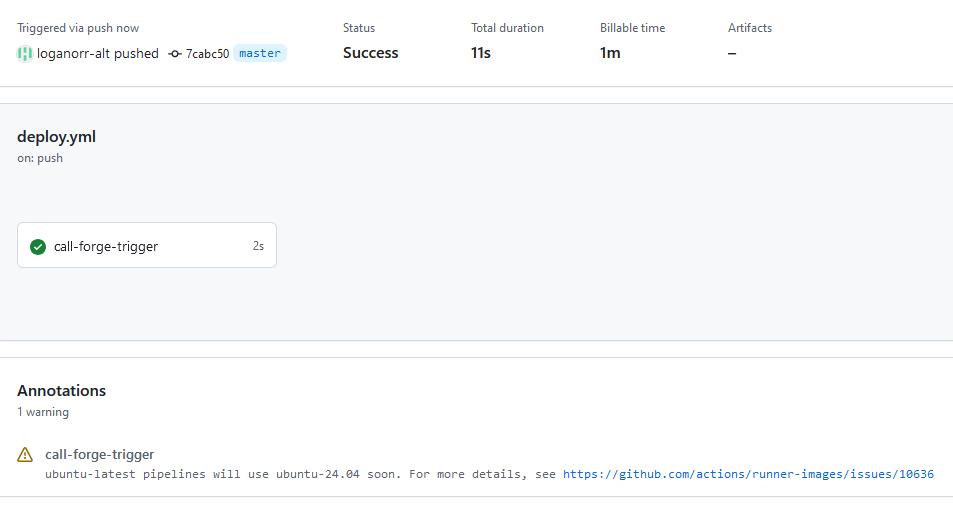
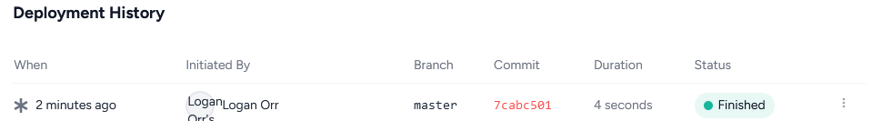

# Automating deployments

There are a few options available for automating deployments. 

- Forge itself has a 'Quick deploy' mode. This monitors the repository and automatically triggers a deployment when one occurs.
- Tools such as Github Actions, or AWS Codepipelines for running continuous integration pipeline. In the example below I'll explain how to do this using GitHub actions.


## Github actions

In Github it is easy to set up CI/CD actions - any yml file in the /.github/workflows directory will automatically be read by Github. 

Over the following explanation I'll use triggering a Forge rebuild as an example. 

Forge has a great yml sample for automatically calling the Forge api to trigger a rebuild [here](https://forge.laravel.com/docs/sites/deployments#example-with-github-actions). I will not be using that here, instead I'll use a second method Forge has available - a trigger url that can be run.

This trigger url looks something like `https://forge.laravel.com/servers/865308/sites/2549588/deploy/http?token=[UNIQUE FORGE API TOKEN]`

### Building out a deployment yml file.

First create a yml file in the `.github/workflows` workflow directory in your repository. I've created one called deploy.yml - [you can see the complete file here](../.github/workflows/deploy.yml.example)

**1. The first line is the name, this is how we'll identify it in Github:**

```
name: Trigger Forge Deployment
```

**2.  Next is the trigger, it follows the format `on:` and then the action, and finally any rules that should be matched. **

The action will often a push to a branch, or a PR request, tag questions etc. While the rule will ussually be the name of a branch.

In my Forge example I will use a push to a branch named master as the trigger. Master is commonly also called main - master is the default branch name when creating a new git repository locally, main is the default if you create it through the Github interface.

```
on:
  push:
    branches: [ master ]
```

As a rule of thumb, you normally wouldn't be running an automated deployment off master. Not many gitflows do this - often a release tag or release branch is better. Like so:

```
# run on the creation of a tag with a version number e.g v0.1.2
on:
  push:
    tags: [ 'v*.*.*' ]
```


**3. We then describe the job we want run. This part is also the most complicated. **

To get started we add a `jobs:` section followed by a set of actions we'll like to see take place.

In my Forge example, I want to run a request to the url `https://forge.laravel.com/servers/865308/sites/2549588/deploy/http?token=[UNIQUE FORGE API TOKEN]` - where `UNIQUE FORGE API TOKEN` is a special api token generated by Forge.

Before continuing, it's not wise to put API tokens in Github. Instead it's better to use Githubs secret manager. You can add this by going into your project settings > secrets and variables > actions. Then clicking the 'new repository secret' button.  I've called my secret `FORGE_API_TOKEN`.

Back to the Github Action, after jobs, we add a name of a job. This can be anything - i've called mine `call-forge-trigger`, and then what we want the action to run on, ubuntu will do. Like so:

```
jobs:
  call-forge-trigger:
    runs-on: ubuntu-latest
```

Finally we add the steps we want to be undertaken. I only want one step to be run, a curl request to call my Forge trigger. The only complication is we need to fetch the `FORGE_API_TOKEN` from Githubs secret manager - this can be done with `${{ secrets.FORGE_API_TOKEN }}`. Here i've loaded this variable into the action as an environment variable first, and then referenced that environment variable in the curl request - exactly how you would do this on the command line.    


```
jobs:
  call-forge-trigger:
    runs-on: ubuntu-latest
    steps:
      - name: Call Forge Deployment URL
        env:
          FORGE_API_TOKEN: ${{ secrets.FORGE_API_TOKEN }}
        run: |
          curl -X GET "https://forge.laravel.com/servers/865308/sites/2549588/deploy/http?token=$FORGE_API_TOKEN"
```


4. **Finally, when you commit and push up this code it should (if done right) run this action.**

See the two screenshots below. The first shows the job `call-forge-trigger` running in Github Actions. The second shows it successfully triggering a deployment in Forge.



