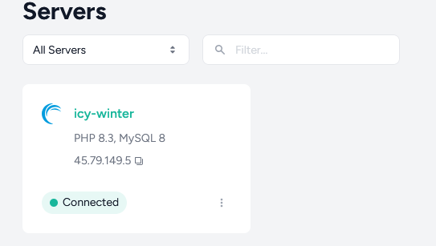
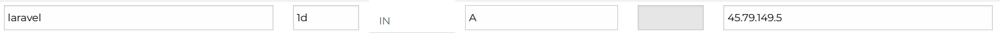

# Configuring and deploying to Laravel Forge

**The server I provisioned using Forge is available here:** [https://laravel.tuffing.co.nz/](https://laravel.tuffing.co.nz/)

I'll allow this server to stay up for 2-3 weeks, assuming cancelling a Forge account doesn't destroy the provisioned server. It's running on a cheap Linode server, so I'm not too worried about the price on that end. 

For time limitation reasons, here I go over the steps to set up Forge by hand. However forge has both a CLI and an SDK - the SDK being able to provision new servers. This would be perfect for creating a server by a script or in a pipeline - though there are limited uses for this. It could be useful to update an existing server via standardised scripts / config as code for example. I wouldn't advise using a code pipline to do this. It could get rapidly expensive quickly.

# Set up prerequisties

Forge doesn't do the actual hosting itself. So to prepare we'll need:

- A server host. In this example I've gone with Linode.
- A source control host - github in this case
- A forge itself.
- A domain. The server can potentially still be called by it's public IP but it would be troublesome. You'd need to override the default 'site' on Forge. I created a laravel.tuffing.co.nz subdomain for this.

Steps:

### Preparation.

Forge will need api access into your server host.

I'm using Linode, where you can do this by genenerting a person access token via their interface:

1. Click on my profile -> click Add personal Access Token
2. Fill this form in and set access controls. For this demo i've set expiry to a month, and set access to what i think may be needed. 
3. Note down the token. Make sure not to commit this into github.

Make sure the Laravel site is in a github repository as well. I recommend to make sure that Laravel is at the root directory of your repository. On my run through here I wanted to use the Laravel site in this repo in the `/laravel-sample` sub directory. It should be possible by modifying the Forge deployment script, however at this point it was feeling hacky (and time consuming) and so I created a new repository just for this purpose. 

### Set up Forge

note: to continue you need to agree to a plan. It's only a 5 day trial, but then $12usd a month.
The server you host on will also cost money, I picked a $5usd linode server for this exercise. 

If you havn't made a Forge account before (like myself), on first login you'll be asked to link in a source control account, and a service provider. This can also be done from account settings.

Just following through the wizard. Using the key generated in the preparation phase. Linodes parent company is Akamai.

#### Set up a server

In forge click on the server menu link and click 'create server'. 

Select the server set up you'd like to use, i went with an app server running on a 'ninode' box ($5usd a month). Running an app server sets up a database on the machine as well, useful in this case. It sets up a little too much with memcache and redis, but that's fine for now. 

A server will be spun up for you on your server host:

## Set up the site

Go into your new server in Forge and click 'create a site'.

On the form, put in the domain you've prepared - I've gone with laravel.tuffing.co.nz. 

On this same form, indicate you'd like to create a database. I called mine laravel.

Configure your domain settings to point an A record at the public ip address of the new server. The ninode server Forge created for me has a public IP of `45.79.149.5`:

## Link in the repo

Next screen I select the repository to use - for time sake i used a used a second repository in which Laravel was placed in the root of the repo. To use a sub directory like in this repository i would likely need to modify the deploy script.

## SSL

Finally I enabled ssl - this was just a matter of going to the SSL section and running letsencrypt.

This step is optional, the site is already available on [http://laravel.tuffing.co.nz/](http://laravel.tuffing.co.nz/).

My only change was to remove www.laravel.tuffing.co.nz - as i'm only supporting laravel.tuffing.co.nz for this exercise.

The server is now provisioned and deployed: (https://laravel.tuffing.co.nz/)[https://laravel.tuffing.co.nz/]

